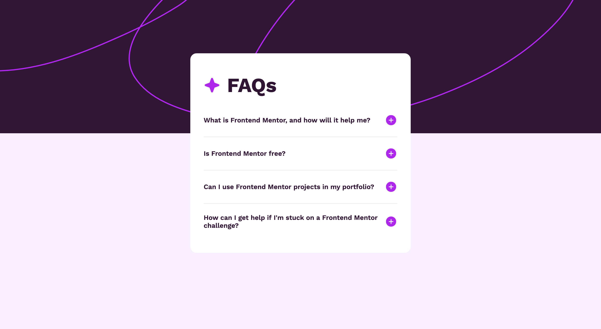
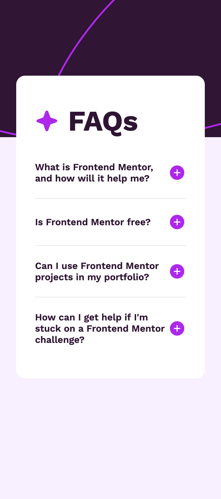

# Frontend Mentor - FAQ accordion

This is a solution to the [FAQ accordion challenge on Frontend Mentor](https://www.frontendmentor.io/challenges/faq-accordion-wyfFdeBwBz). Frontend Mentor challenges help you improve your coding skills by building realistic projects. 

## Table of contents

- [Overview](#overview)
  - [Screenshots](#screenshots)
  - [Links](#links)
- [My process](#my-process)
  - [Built with](#built-with)
- [Author](#author)

## Overview

### Screenshot

### Links

- Solution URL: [GitHub Repo](https://github.com/joysterr/fm-accordion-main)
- Live Site URL: [GitHub Pages](https://joysterr.github.io/fm-accordion-main)

## My process
### Built with

- Simple HTML & CSS
- CSS Flexbox
- JS, DOM manipulation

## Author

- GitHub - [@joysterr](https://github.com/joysterr)
- Frontend Mentor - [@yjoysterr](https://www.frontendmentor.io/profile/joysterr)